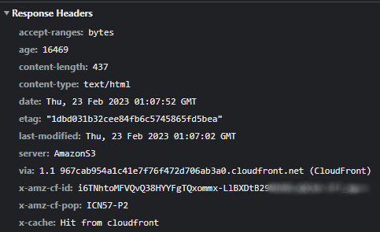

# Remove S3 Metadata Headers

## What is S3 Metadata Headers?

If you use S3 bucket to CloudFront origin, you can see s3 metadata like this:


They show some sensitive information like KMS key id and S3 object version id. You should hide this information and serve to clients like this:



## Create CloudFront `response headers policy`

=== "Using AWS CLI"
    ``` shell
    aws cloudfront create-response-headers-policy \
        --response-headers-policy-config "Name=remove-s3-metadata,RemoveHeadersConfig={Quantity=5,Items=[{Header=x-amz-replication-status},{Header=x-amz-server-side-encryption},{Header=x-amz-server-side-encryption-aws-kms-key-id},{Header=x-amz-server-side-encryption-bucket-key-enabled},{Header=x-amz-version-id}]}"
    ```

=== "Using CloudFormaiton"
    ``` yaml
    CloudFrontResponseHeadersPolicy:
      Type: AWS::CloudFront::ResponseHeadersPolicy
      Properties:
        Name: remove-s3-metadata
        RemoveHeadersConfig:
          Items:
            - "x-amz-replication-status"
            - "x-amz-server-side-encryption"
            - "x-amz-server-side-encryption-aws-kms-key-id"
            - "x-amz-server-side-encryption-bucket-key-enabled"
            - "x-amz-version-id"
    ```